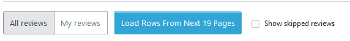
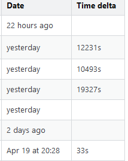

# Review Detlas

This script adds a Time delta column to the history view of a review queue, as well as a button to load rows from the next 19 pages. 

## Installation

- Install the userscript with
[this direct link](https://raw.githubusercontent.com/aellliott1485/SE-Userscripts/master/review-deltas/review-deltas.js).

developed & tested with Violentmonkey on Firefox
